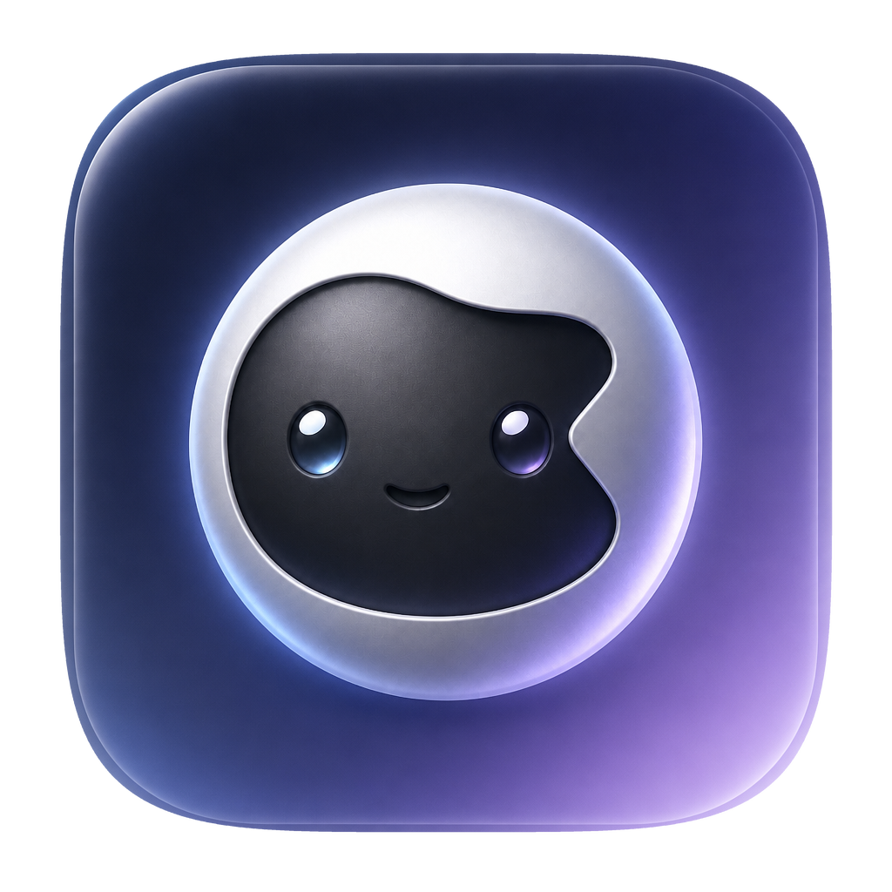
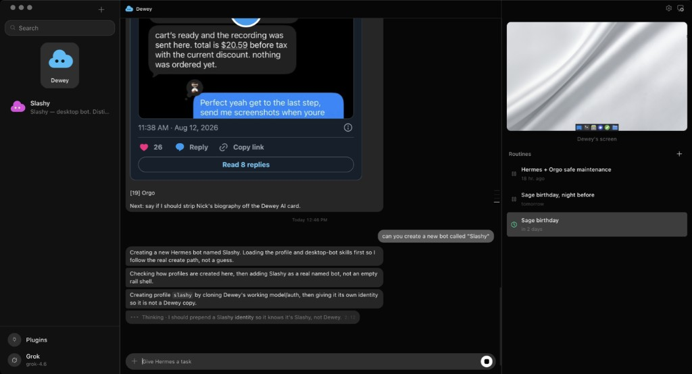
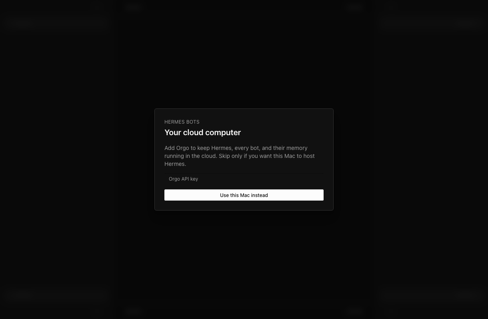
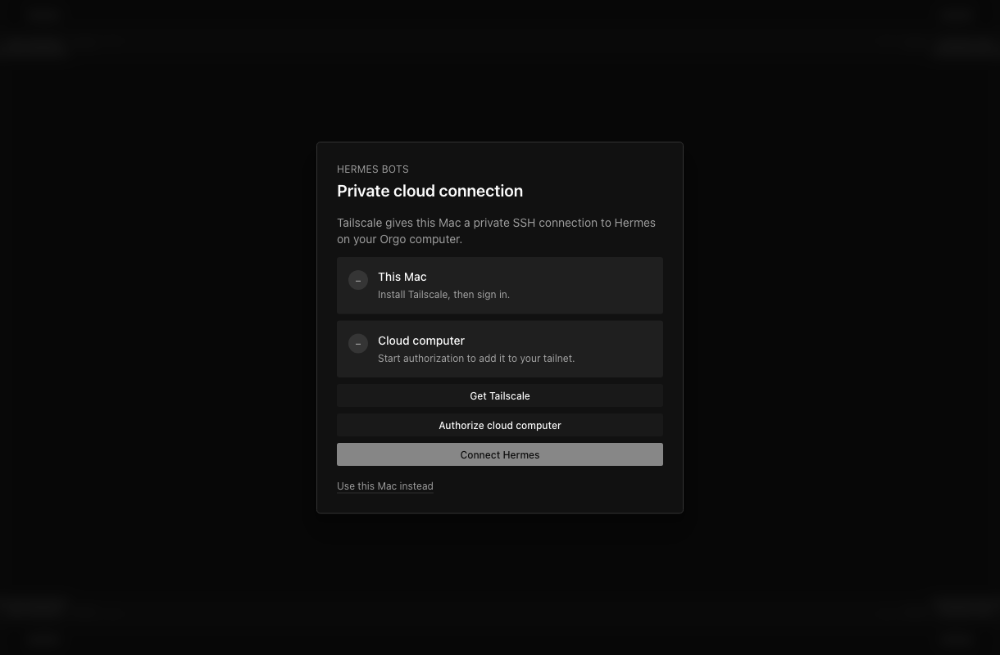
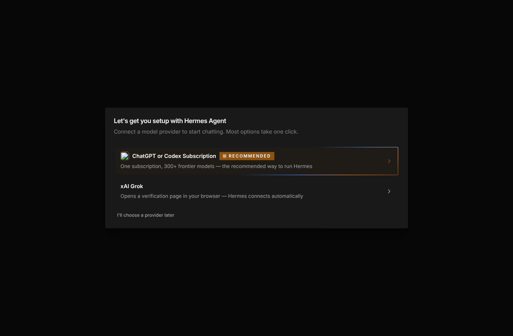
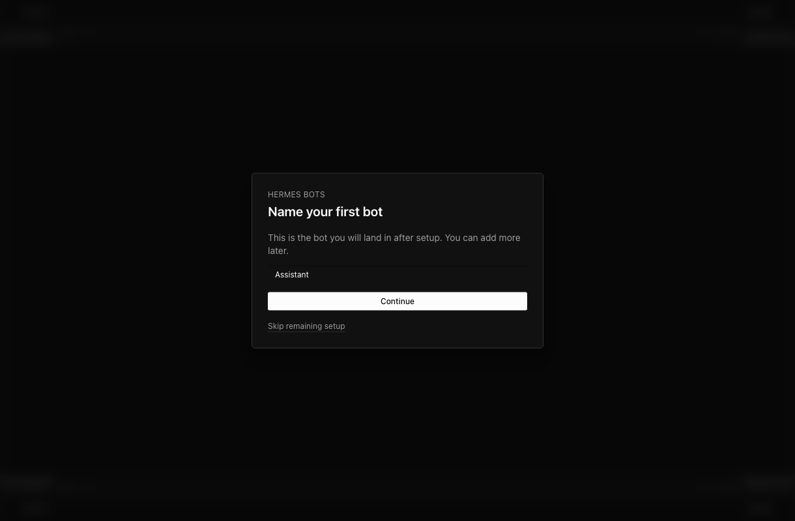
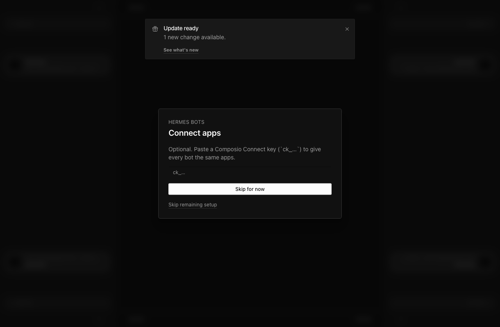
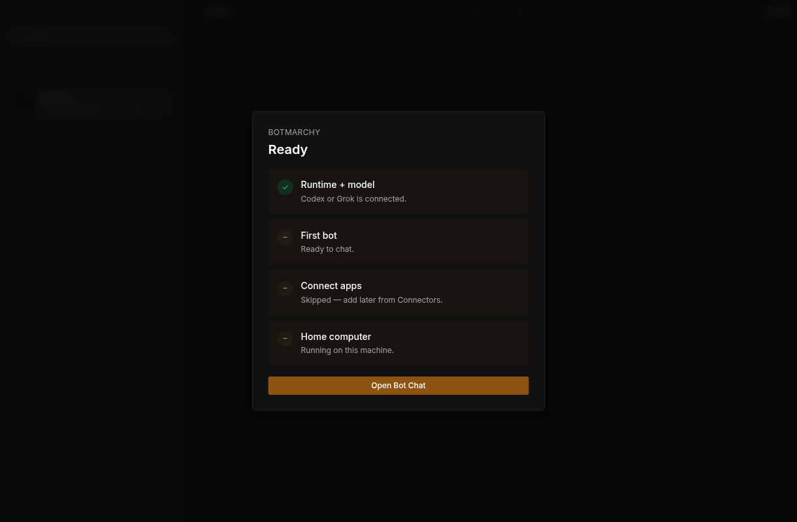
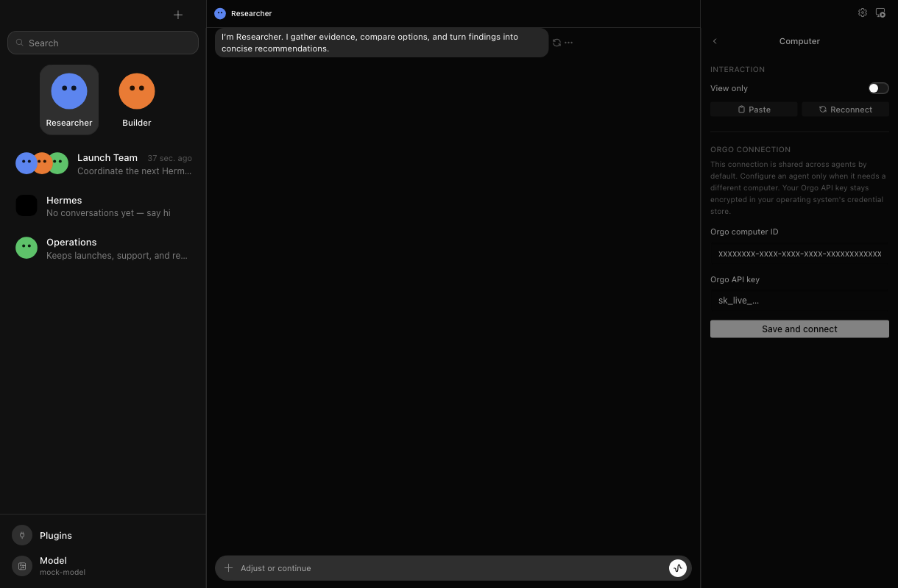
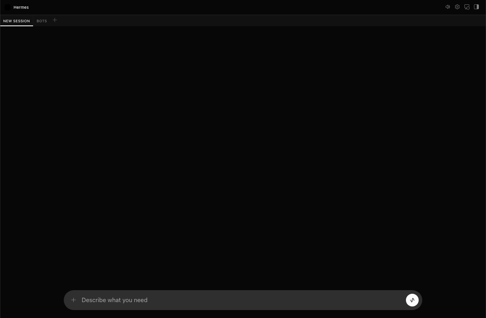

<p align="center">
  
</p>

# Botmarchy

> **The court of Omarchy.**

Your Omarchy machine is the kingdom. Your bots are its court — advisors,
researchers, and engineers with persistent memory, skills, and a shared
court chamber (a computer they can actually use). Botmarchy runs on your
hardware, over your tailnet, with the model subscriptions you already pay
for.

Botmarchy is a fork of [Korgo Bot](https://github.com/nickvasilescu/korgo-bot)
(ultimately [Hermes Agent](https://github.com/NousResearch/hermes-agent) by
Nous Research), re-pointed from the Orgo cloud at a self-hosted Linux box:
any always-on machine on your tailnet becomes the bots' home. See
[`docs/selfhost-linux-plan.md`](docs/selfhost-linux-plan.md) for the
architecture and current status.

## Connect your own computer

Run a desktop build (`npm --workspace apps/desktop run dev:bot` from a
checkout), then in first-run setup choose **Use my own computer** and enter
`user@host` (port, SSH key, and a custom Hermes path are optional). The app
verifies the computer over SSH before connecting — it needs:

1. SSH reachable from this machine (tailnet or LAN), key-based login
   (`ssh-copy-id user@host`)
2. Hermes installed on that computer, pinned to the compatible ref:

   ```bash
   curl -fsSL https://hermes-agent.nousresearch.com/install.sh \
     | bash -s -- --commit ad9e8c9b574ec6937cc09d8901ca83a769225963 --skip-setup
   ```

3. A provider credential on that computer (`hermes setup` there, or copy an
   existing `~/.hermes/auth.json`)

Bots, memory, and conversations live on that computer; the desktop connects
over SSH (no cloud service, no exposed ports). Full runbook:
[`docs/mini-pc-setup.md`](docs/mini-pc-setup.md).

---

*The remainder of this README is inherited from upstream and describes the
original Orgo-based product.*

# Korgo Bot (upstream README)

Korgo Bot is a focused macOS desktop app for creating persistent AI bots, giving them connected apps, and letting them share a private cloud computer.

It packages the Hermes Agent runtime behind a Bot-first interface. Your Mac runs the desktop UI; when cloud mode is enabled, bot profiles, conversations, memory, skills, and tool execution live on your Orgo computer and are reached over a private Tailscale connection.

> **Source-first preview:** Running from this repository is the supported path today. Advanced users can build a local `.app` or DMG, but Korgo Bot is not currently distributed through the Mac App Store or as a notarized public download.



## What you can do

- Create multiple bots with separate identities and persistent conversations.
- Switch bots without losing each bot's canonical **Bot Chat**.
- Create group chats and mention bots with `@handles`.
- Connect shared apps through Composio.
- Give every bot access to one shared Orgo cloud computer.
- Use direct screen, shell, and file tools or delegate a bounded GUI task to Orgo's hosted computer-use agent.
- Watch and control that computer through the built-in desktop viewer.
- Pin frequently used bots and coordinate them in group chats.
- Keep Hermes and bot state in the cloud instead of tying it to your laptop.
- Use light, dark, or system appearance without changing the active bot.

## Before you start

You need:

1. A Mac running a current supported macOS release.
2. Git, Node.js 22.22 or newer, a supported npm release (`<11.10.0` or `>=11.17.0`), and [`uv`](https://docs.astral.sh/uv/getting-started/installation/). The setup script uses `uv` to install the pinned Python 3.11 environment.
3. An [Orgo](https://www.orgo.ai/start) account and API key for cloud mode.
4. A [Tailscale](https://tailscale.com/download/mac) account and the Tailscale Mac app. A free personal plan is sufficient for the private connection used here.
5. Either:
   - a ChatGPT/Codex subscription; or
   - an xAI Grok account.
6. Optionally, a Composio Connect key for shared app integrations.

Cloud setup provisions an Orgo computer with 8 GB RAM and 4 CPU cores. The computer and delegated computer-use runs may consume Orgo plan credits.

## Run Korgo Bot from GitHub

### Give the repository to a coding agent

Send your coding agent this repository URL and the prompt in [`docs/agent-assisted-setup.md`](docs/agent-assisted-setup.md). The agent will clone the repository, verify prerequisites, install from the committed lockfiles, and launch the Bot product.

### Run it yourself

```bash
git clone https://github.com/nickvasilescu/hermes-bots.git
cd hermes-bots
./scripts/setup-hermes-bots.sh --verify --run
```

Setup does not delete `~/.hermes`, create cloud resources, or save credentials. Those actions only occur after the app opens and you explicitly complete the first-run guide.

The installed product keeps the stable bundle identifier and legacy `Hermes Bots` Application Support directory so existing users retain credentials, permissions, and local state across the Korgo Bot rebrand. *Botmarchy note: this fork changed both — appId `dev.botmarchy.Botmarchy`, user data `~/.config/Botmarchy` (pre-release break; see `docs/selfhost-linux-plan.md` for the one-time copy).*

### Build a local macOS app

From `apps/desktop`:

```bash
npm run pack:bot          # unpacked Korgo Bot.app
npm run dist:bot:mac:dmg  # local DMG
```

These local builds are useful for testing. Public distribution still requires the normal Apple signing and notarization credentials.

## First-run setup

The setup journey is:

**Orgo → Tailscale → Codex or Grok → First bot → Connected apps → Bot Chat**

### 1. Create your cloud computer

Paste your Orgo API key. Korgo Bot will:

- create or reuse the current `Korgo Bot` workspace (Botmarchy names it `Botmarchy`), including a legacy `Hermes Bots` workspace from an earlier build;
- create or reuse the canonical shared computer, recovering safely from duplicate-name races;
- pin compatibility to Orgo's `system/hermes-agent@1.0.0` template;
- start the computer;
- verify Hermes is installed;
- apply the bundled Korgo desktop wallpaper;
- install and verify the delegated Orgo agent server; and
- synchronize both Orgo MCP integrations to every bot profile.

Choose **Use this Mac instead** if you want a local-only setup.



The Orgo key is encrypted with Electron `safeStorage`. It is never returned to the renderer after being saved.

Provisioning shows staged progress because creating the computer, preparing Hermes, installing tools, and applying the wallpaper can take several minutes. Once the computer is provisioned, setup checkpoints at the private-connection step instead of creating another computer after a retry.

### 2. Connect privately with Tailscale

Korgo Bot uses Tailscale SSH so the Hermes gateway is not exposed to the public internet.

1. Install and open Tailscale on your Mac.
2. Sign into Tailscale.
3. Click **Authorize cloud computer**.
4. Approve the Orgo computer in the browser page that opens.
5. Wait for **This Mac** and **Cloud computer** to show connected.
6. Click **Connect Hermes**.



Korgo Bot then switches from its local bootstrap gateway to Hermes running on the Orgo computer. Future reconnect attempts start the shared computer before opening Tailscale SSH.

If Tailscale cannot issue a sign-in link, Korgo Bot checks Tailscale's service status and keeps retries from starting competing login processes. A coordination-service outage is not a Tailscale plan or billing failure.

### 3. Choose the model provider

Choose **ChatGPT or Codex Subscription** or **xAI Grok** and complete the browser/device authorization flow.



Provider credentials are configured on the remote Hermes installation when cloud mode is active.

### 4. Name your first bot

Give the first bot a short descriptive name such as:

- Researcher
- Executive Assistant
- Support
- Content Planner
- Engineer



The first bot inherits the provider and model you just connected, is pinned to the top of the bot shelf, and opens directly into its persistent canonical conversation called **Bot Chat**. Each additional bot is backed by its own Hermes profile and can have its own model assignment.

### 5. Connect apps

Optionally paste a Composio Connect key (`ck_…`). Connected tools are synchronized to every bot profile and trigger an MCP reload; the app may ask you to confirm that reload.



You can skip this step and configure connectors later.

### 6. Open Bot Chat

Review the readiness checks and click **Open Bot Chat**.





## Your first five-minute test

After setup:

1. Open your first bot.
2. Send: `Introduce yourself and remember that this is our first test.`
3. Send: `Use the shared computer to create /root/Desktop/korgo-bot-test.txt.`
4. Open **Computer** from the top-right controls.
5. Confirm the file appears on the Orgo desktop.
6. Create a second bot.
7. Ask the second bot to inspect the same file.
8. Switch back to the first bot and confirm its original conversation returns.
9. Quit and reopen Korgo Bot.
10. Confirm the bots, conversations, provider, and shared computer reconnect.

## Using Korgo Bot

### Bots

A bot is a Hermes profile with its own:

- identity and instructions;
- model assignment;
- memory and learned skills;
- conversation history;
- canonical Bot Chat;
- avatar and display metadata.

The normal workspace keeps the bot roster visible on the left, the active Bot Chat in the center, and the shared computer and routines on the right.



The first bot is pinned automatically. Pin or unpin other bots from their menu. Profile switches are serialized and stale navigation is discarded, so a slower previous request cannot switch the UI back to the wrong bot.

### Group chats

Create a group, add multiple bots, and use `@bot-name` to direct a message. Group-session routing is isolated from each bot's canonical chat.

### Shared computer

All bots inherit the default Orgo computer. The built-in noVNC viewer fetches a fresh password whenever it connects because Orgo rotates VNC credentials after restarts.

### Built-in computer tools

Every cloud bot receives two Orgo integrations:

- **`orgo`** provides direct computer lifecycle, screen, shell, and file tools pinned to the shared computer.
- **`orgo-agent`** provides `orgo_agent_run`, a high-level tool that delegates a bounded GUI or browser task to Orgo's hosted computer-use agent.

Delegated runs default to 30 steps, are limited to 100 steps, and use a cross-process lock so two bots cannot move the shared mouse at the same time. They use the Orgo account connected during setup and may draw from that account's credits or plan allowance.

### Connectors

Composio and Orgo MCP entries are synchronized whenever the bot roster changes. Creating, duplicating, or deleting a bot refreshes the MCP configuration.

### Appearance

Choose light, dark, or system mode. Korgo's chat surface, command menu, dialogs, plugin popovers, desktop controls, and native window chrome follow the selected mode.

### Routines

Open the computer drawer to configure scheduled agent routines. Cloud mode allows the Hermes process and its state to remain on the Orgo computer when your laptop is not hosting the runtime.

## How cloud mode works

The connection path is:

```text
Korgo Bot on your Mac
  → Tailscale SSH
  → Hermes gateway on the Orgo computer
  → bot profiles, sessions, memory, skills, and MCP tools
```

The computer viewer uses a separate path:

```text
Korgo Bot
  → Orgo API
  → rotating VNC session
  → shared Orgo desktop
```

Delegated computer use follows a third path:

```text
Bot on the remote Hermes runtime
  → orgo-agent MCP
  → Orgo hosted computer-use API
  → the same shared Orgo computer
```

The app never exposes the Hermes gateway directly to the public internet.

## Where data is stored

On the Mac:

- encrypted Orgo and Composio desktop credentials;
- product window and UI preferences;
- local plugin presentation state.

On the Orgo computer in cloud mode:

- Hermes profiles;
- session databases and transcripts;
- memory and skills;
- provider configuration;
- MCP configuration;
- files created on the shared desktop.

Group definitions and pinned-bot presentation state are currently local to the desktop app.

See [`PRIVACY.md`](PRIVACY.md) for the complete Orgo, Tailscale, VNC, Composio, provider, and extension data flow.

## Security model

Hermes bots can run commands, read and write files, use connected apps, and control the shared computer. Review skills, plugins, MCP servers, and approval requests before granting access. The bundled Orgo and Composio MCP entries are labeled `untrusted`, but that label is not an isolation boundary.

The shared Orgo computer is single-tenant infrastructure for one owner. Bots on that computer are not isolated from each other and can potentially reach the same files and credentials. Content from the web, email, connected apps, and other external systems must be treated as untrusted input.

Keep the Hermes gateway behind Tailscale, scope third-party credentials to the minimum required permissions, and never commit credentials to this repository. See [`SECURITY.md`](SECURITY.md) for the full trust model and private vulnerability reporting.

## Troubleshooting

### This Mac does not connect in the Tailscale step

- Install the Tailscale Mac app.
- Open it and verify you are signed in.
- Confirm the menu bar icon reports **Connected**.
- Return to Korgo Bot and wait a few seconds.

### The cloud computer does not connect

- Click **Authorize cloud computer** again.
- Approve the device using the same Tailscale account as the Mac.
- Check that your tailnet policy permits Tailscale SSH for your user.
- Confirm the computer is running in the Orgo dashboard.

### Tailscale does not provide a sign-in link

- Check [Tailscale's service status](https://status.tailscale.com/). A coordination-service outage prevents new device authorization and is not caused by your free or paid plan.
- Wait for the coordination service to recover, then click **Authorize cloud computer** again.
- If Korgo Bot reports that the private connection took too long, the cloud computer is already provisioned; retry authorization instead of creating another computer.
- Persistent failures after Tailscale recovers can indicate blocked access to `controlplane.tailscale.com` or SSL inspection on the cloud network.

### Connect Hermes fails

The Mac and Orgo computer must be on the same tailnet. If your organization uses custom Tailscale access controls, permit SSH access to the Korgo Bot device as `root`.

### Provider setup does not finish

- Return to the authorization browser tab.
- Complete the Codex or Grok device flow.
- Keep Korgo Bot open until it reports success.
- Retry the provider from Settings if the device code expires.

### The shared computer is blank

- Confirm the Orgo computer is running.
- Close and reopen the Computer drawer to request a fresh VNC password.
- Use the reconnect action if Orgo recently restarted the computer.

### Delegated computer use fails

- HTTP 402 means the Orgo account does not have enough credits for that run.
- HTTP 403 means the current Orgo plan or API key does not allow the requested computer-use run.
- HTTP 429 means Orgo rate-limited the run; wait and retry.
- If another bot is controlling the shared computer, wait for that run to finish before starting another delegated task.

### Reset a development installation

For an isolated clean run:

```bash
export HERMES_BOTS_E2E_DIR="/tmp/hermes-bots-e2e-$(date +%s)"
HERMES_DESKTOP_USER_DATA_DIR="$HERMES_BOTS_E2E_DIR" npm --workspace apps/desktop run dev:bot
```

Do not delete your normal `~/.hermes` directory to reset a test; it may contain valuable profiles and conversation history.

## Development

From `apps/desktop`:

```bash
npm run dev:bot            # Bot product in development mode
npm run test:e2e:bot       # Mocked product-shell E2E
npm run typecheck          # Renderer, Electron, and E2E type checks
npm run pack:bot           # Local unpacked Korgo Bot.app
npm run dist:bot:mac:dmg   # Local macOS DMG
```

Run the focused Orgo and remote-runtime tests:

```bash
npx vitest run \
  electron/orgo-broker.test.ts \
  electron/connection-config.test.ts \
  electron/remote-lifecycle.test.ts
```

Regenerate the onboarding screenshots:

```bash
VITE_HERMES_DESKTOP_PRODUCT=bot \
HERMES_DESKTOP_PRODUCT=bot \
npx playwright test e2e/bot-product-docs.spec.ts
```

## Updating a source checkout

```bash
git pull --ff-only
./scripts/setup-hermes-bots.sh --verify
npm --workspace apps/desktop run dev:bot
```

Korgo Bot stays on the proven single shared-Orgo architecture. The Orgo template is compatibility-pinned, and generic Hermes client/backend update prompts are disabled in the Bot product. Source users update the client and compatibility policy together by pulling a reviewed Korgo Bot commit. Cross-machine Bot Mode is intentionally deferred for the future one-computer-per-bot architecture.

See [`docs/bot-product-release-scope.md`](docs/bot-product-release-scope.md) for the compatibility policy, accepted upstream hardening, deferred work, and release gate.

## Upstream and license

Korgo Bot is built on [Hermes Agent](https://github.com/NousResearch/hermes-agent) by Nous Research.

Korgo Bot is an independent open-source project and is not endorsed by or affiliated with Nous Research or the third-party services it integrates.

The original upstream README is preserved at [`docs/upstream-hermes-agent.md`](docs/upstream-hermes-agent.md). See [`LICENSE`](LICENSE) and [`NOTICE.md`](NOTICE.md) for licensing and attribution, [`PRIVACY.md`](PRIVACY.md) for data flow, [`CONTRIBUTING.md`](CONTRIBUTING.md) to contribute, [`SUPPORT.md`](SUPPORT.md) for help, and [`SECURITY.md`](SECURITY.md) for private vulnerability reporting.
